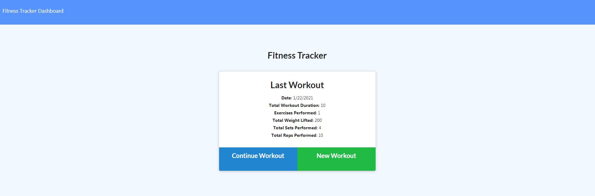
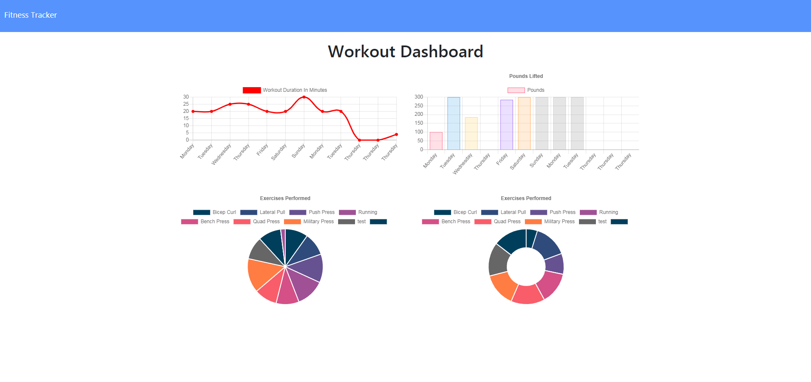

# Workout-Tracker

## Description

An application that will allow you to keep track of your workouts. Add new workouts and continue existing ones. Choose between resistance and cardio and enter all the fields. When you click add exercise, the exercise will be entered into the Mongo Atlas database if using the deployed app. If using localhost it will be entered into your local Mongo database. The dashboard page will show you various stats.

## Table of Contents

- [Installation](https://github.com/kas1330/Workout-Tracker#installation)

- [Usage](https://github.com/kas1330/Workout-Tracker#usage)

- [License](https://github.com/kas1330/Workout-Tracker#license)

- [Contributions](https://github.com/kas1330/Workout-Tracker#contributions)

- [Testing](https://github.com/kas1330/Workout-Tracker#testing)

- [Questions](https://github.com/kas1330/Workout-Tracker#questions)

- [Repo](https://github.com/kas1330/Workout-Tracker#repo)

- [Deployed](https://github.com/kas1330/Workout-Tracker#deployed)

## Installation

Use git clone to copy the repository to your computer. Use npm start to start the server. Then go to localhost:3000 in the browser, and the app should pop up.

## Usage

This purpose of this app is to demonstrate the use of a NoSQL database in the context of a full stack application.

## License

MIT License

## Contributions

Submit a pull request.

## Testing

The easiest way to test the function of the application would be to click on the link to the deployed app on Heroku. You should be able to add a new workout or continue and existing one. You should also see the dashboard option in the top lefthand corner, this will show you some stats and charts. The more difficult way to test would be to git clone the repository, npm install everything, set up your connection in the server.js file, run the seed file using "node seeders/seed.js", and start the server using npm start. Go to your browser and type in "localhost:3000", this will launch the app, and you should be able to follow the same steps as the deployed version to test the app.

## Questions

https://github.com/kas1330

k.sexton804@gmail.com

## Repo

https://github.com/kas1330/Workout-Tracker

## Deployed

https://workout-tracker234.herokuapp.com/
